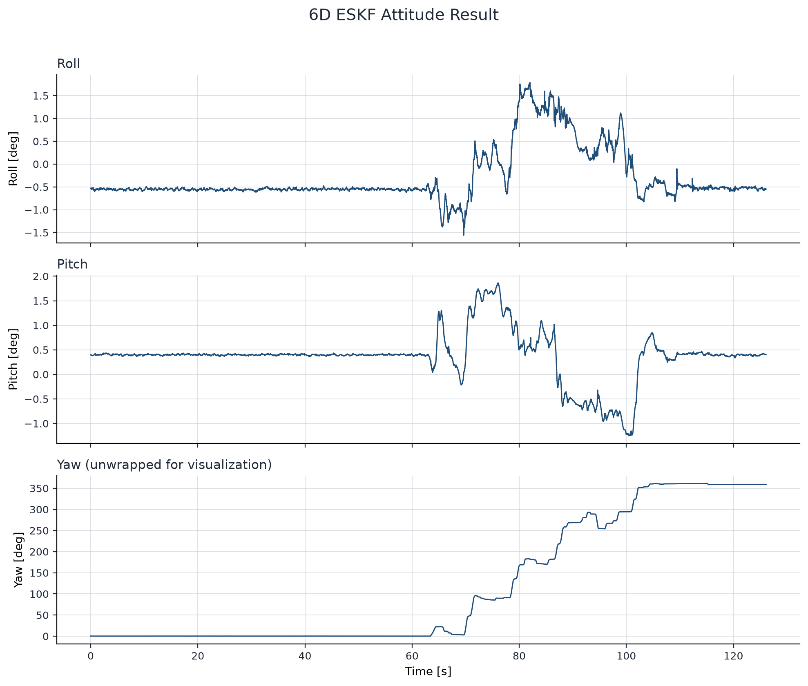
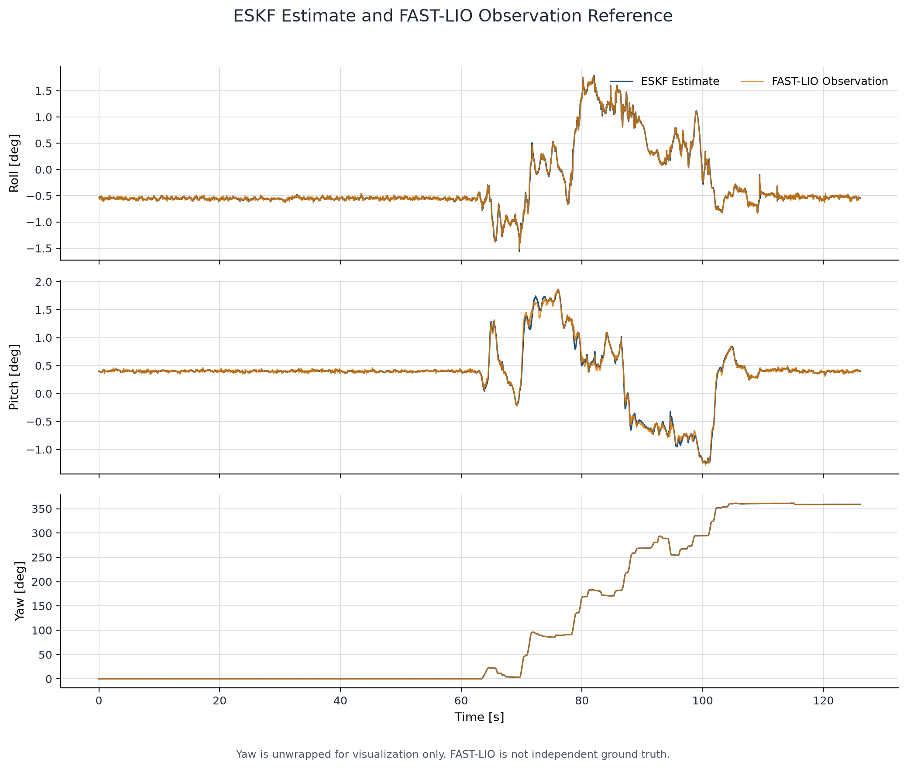
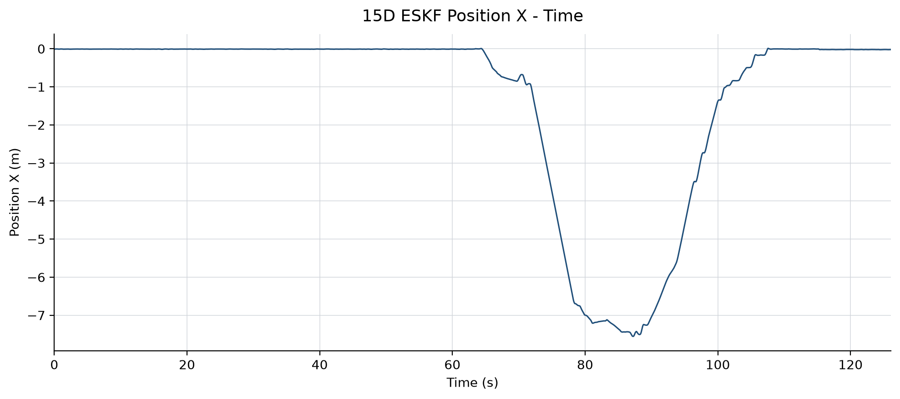
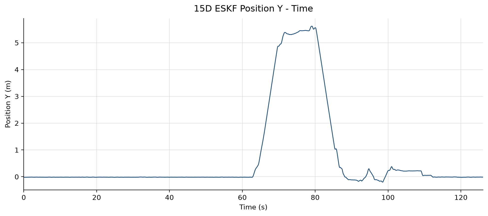
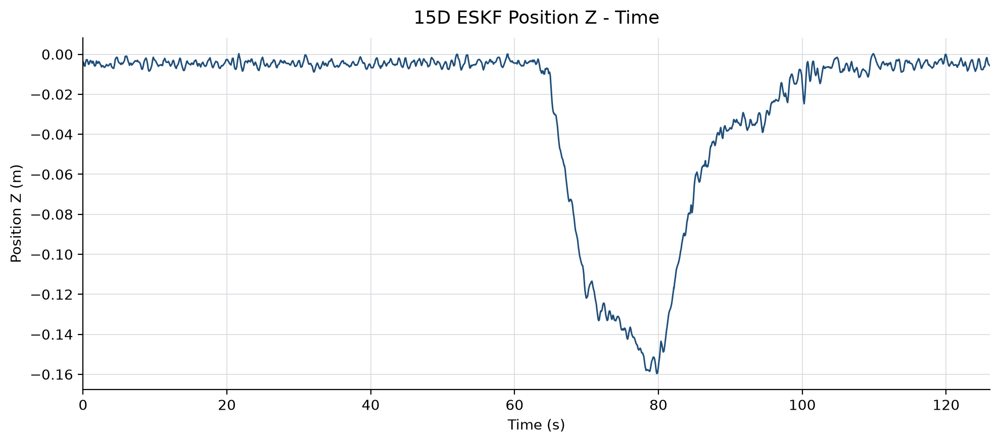
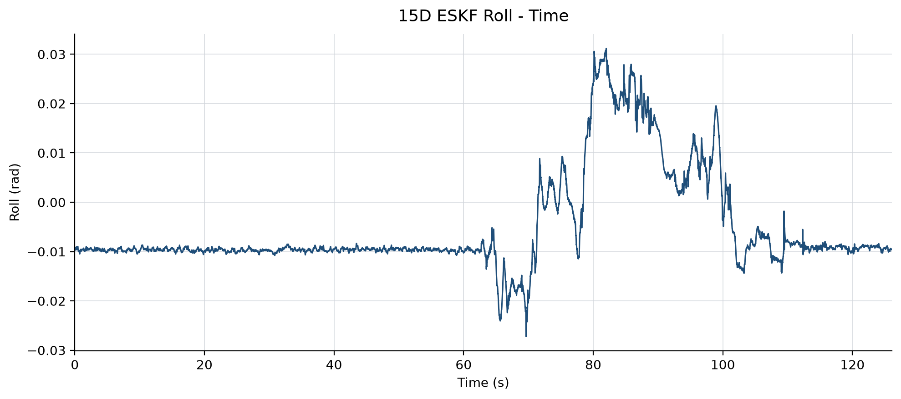
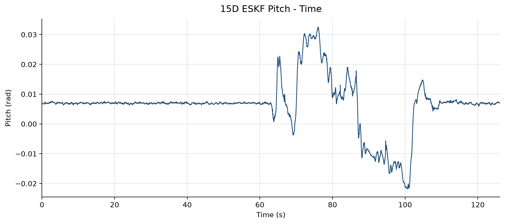
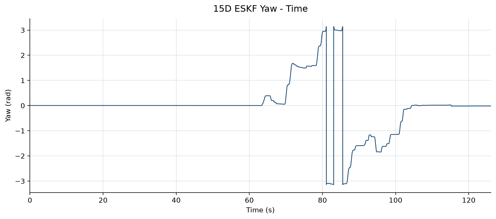

# 基于 IMU + FAST-LIO 的 6D / 15D ESKF 位姿解算

## 1. 项目简介

本项目完成传感器组考核题目二的全部必做内容：使用 IMU 陀螺仪进行姿态 Prediction，使用 FAST-LIO 四元数作为 Observation，实现仅包含姿态和陀螺仪零偏的 6D Error-State Kalman Filter（ESKF），并输出 Roll、Pitch、Yaw 数据及时间曲线。

在保留 6D 必做实现及验证结果的基础上，本项目还完成了 15D 位置估计选做扩展，估计位置、速度、姿态以及陀螺仪和加速度计零偏。第 3–16 节保留原有 6D 说明；第 17 节说明 15D 实现、复现方法及交付结果。

6D 滤波器的名义状态为：

```text
x_hat = (q_hat, b_g_hat)
```

误差状态为：

```text
delta_x = [delta_theta, delta_b_g]
```

共 6 维。15D 扩展使用独立的误差状态与协方差传播，名义状态包含位置、速度、四元数和两个零偏。

正式结果可直接查看：

- [6D ESKF 逐帧结果](results/eskf6d_result.csv)
- [RPY 提交数据](results/rpy_result.csv)
- [实验结果摘要](results/experiment_result_summary.json)
- [RPY 总览图](results/figures/rpy_overview.png)
- [15D ESKF 逐帧结果](results/eskf15d_result.csv)
- [15D 完整运行摘要](results/eskf15d_summary.json)

## 2. 题目要求完成情况

| 题目要求 | 完成情况 |
| --- | --- |
| IMU 数据读取 | ✓ |
| timestamp 与 `dt` | ✓ |
| 静止段 gyro bias 初始化 | ✓ |
| 四元数姿态 Prediction | ✓ |
| `P` Prediction / `Q` Design 与离散化 | ✓ |
| FAST-LIO quaternion Observation | ✓ |
| `R = diag(cov_33, cov_44, cov_55)` | ✓ |
| IMU / FAST-LIO timestamp alignment | ✓ |
| residual / Kalman gain / Update | ✓ |
| Injection / Reset | ✓ |
| Roll、Pitch、Yaw 数据输出 | ✓ |
| Roll-Time / Pitch-Time / Yaw-Time | ✓ |
| 一组完整实验结果 | ✓ |
| 15D 位置估计 | ✓ 选做：位置、速度、加速度计零偏、六维位姿观测 |
| x/y/z 数据及时间曲线 | ✓ |

## 2.1 代码结构与模块职责

项目采用“数据处理 → 数学模块 → 外部调度 → 结果展示”的单向分层。`ESKF6D` 只维护姿态、陀螺零偏和误差状态协方差，不保存 IMU index、timestamp 或 pose index；这些时间与观测调度信息由 runner 负责。

主数据流如下：

```text
data/raw/*.csv
    ↓  scripts/run_preprocess.py
preprocess.py + alignment.py
    ↓
data/processed/*.npz
    ↓  scripts/run_eskf6d.py
initialization.py → ESKF6D + runner6d.py
    ↓
results/eskf6d_result.csv + eskf6d_debug.csv + eskf6d_summary.json
    ↓  scripts/plot_eskf6d_results.py
plot_result.py
    ↓
results/rpy_result.csv + results/figures/*.png
```

核心文件职责：

| 文件 | 所属层 | 主要职责 | 不负责的内容 |
| --- | --- | --- | --- |
| `config.py` | 配置 | 坐标 convention、预处理阈值、滤波噪声参数和 numerical safety | 数据统计和运行时状态 |
| `data_types.py` | 数据结构 | processed data、alignment 和诊断结果的 dataclass | 数据读取和滤波计算 |
| `preprocess.py` | 数据处理 | 原始 CSV 校验、单位转换、`dt` 和初始静止段统计 | IMU/pose 匹配和 ESKF |
| `alignment.py` | 数据处理 | 基于 timestamp 的单调一对一 IMU/FAST-LIO 匹配 | 插值、滤波 Update 和重新匹配 |
| `processed_io.py` | 数据边界 | 校验并加载 `data/processed/*.npz` | 修改 measurement、timestamp 或 covariance |
| `rotation_utils.py` | 数学基础 | xyzw Quaternion、SO(3) Exp/Log、旋转矩阵和 ZYX RPY | ESKF 状态与时间调度 |
| `initialization.py` | 滤波初始化 | 在 `k0` 构造 6D / 15D 名义初值、`P0` 和 `Qc` | Prediction、Observation Update 和循环调度 |
| `eskf6d.py` | 滤波数学 | 6D Prediction、Observation Update、Injection 和 Reset | index、timestamp、pose matching 和文件输出 |
| `runner6d.py` | 外部调度 | 按 IMU 时间推进、选择匹配 observation、记录 posterior/debug/summary | 重新定义 ESKF 数学或重新匹配 timestamp |
| `plot_result.py` | 结果展示 | 从冻结结果生成 RPY 数据、统计和图片 | 重新运行或修改滤波结果 |
| `eskf15d.py` | 滤波数学 | 15D Prediction、Pose Update、Injection 和 Reset | 时间调度和数据读取 |
| `runner15d.py` | 外部调度 | 15D IMU 传播、匹配观测选择及 posterior/debug/summary 输出 | 重新匹配时间戳或定义滤波数学 |

程序入口与开发资产的边界：

| 路径 | 用途 |
| --- | --- |
| `scripts/run_preprocess.py` | 正式预处理入口 |
| `scripts/run_eskf6d.py` | 完整 6D ESKF 正式运行入口 |
| `scripts/plot_eskf6d_results.py` | 正式结果整理和绘图入口 |
| `scripts/run_eskf15d.py` | 完整 15D ESKF 运行入口 |
| `scripts/plot_eskf15d_results.py` | 只读取 15D 正式 CSV，绘制六张位置与姿态曲线 |
| `scripts/analyze_eskf15d.py` | 读取保存的结果进行离线诊断 |
| `scripts/check_*.py` | 单步和边界条件开发验证，不进入正式运行流程 |
| `scripts/analyze_*.py` | 读取已保存结果进行离线诊断，不修改滤波输出 |
| `tests/` | 自动化回归测试，不包含正式算法实现 |

推荐阅读顺序为：`config.py` / `data_types.py` → `rotation_utils.py` → `preprocess.py` / `alignment.py` → `initialization.py` → `eskf6d.py` → `runner6d.py` → 三个正式入口脚本。

## 3. 6D 核心算法

### 3.1 State

| 变量 | 含义 |
| --- | --- |
| `q_hat` | 当前 Body 相对 World 的姿态四元数 |
| `b_g_hat` | 陀螺仪零偏估计 |
| `delta_theta` | 局部小姿态误差 |
| `delta_b_g` | 陀螺仪零偏误差 |

本项目固定采用以下 convention：

- 四元数顺序：`[qx, qy, qz, qw]`（`xyzw`）；
- `R_WB`：Body Frame 到 World Frame，`v_W = R_WB @ v_B`；
- 右乘误差：`R_true = R_hat Exp(delta_theta^)`。

下文用 `Delta_theta_imu` 表示一个采样区间内由 IMU 积分得到的名义旋转增量；`delta_theta` 专指 6D ESKF 中的姿态误差状态，二者不是同一个量。

### 3.2 Prediction Model

先从测得角速度中扣除当前零偏：

```text
omega_hat = omega_m - b_g_hat
```

正式实现使用 left-endpoint Zero-Order Hold（ZOH），即用当前 IMU 帧的角速度代表当前采样区间内的角速度：

```text
Delta_theta_imu = omega_hat * dt
q_new = normalize(q_old ⊗ Exp(Delta_theta_imu))
b_g_new = b_g_old
```

对应的连续误差动力学为：

```text
delta_theta_dot = -hat(omega_hat) delta_theta - delta_b_g - n_g
delta_b_g_dot   = n_bg

Fc = [-hat(omega_hat)  -I]
     [       0          0]

Gc = [-I  0]
     [ 0  I]
```

当前一阶离散化为：

```text
Phi ≈ I + Fc * dt
Qd  ≈ Gc Qc Gc^T * dt
P^- = Phi P Phi^T + Qd
```

`dt` 始终取真实的相邻 IMU timestamp 差值，不使用写死的采样频率。

### 3.3 Observation Model

FAST-LIO 提供 `xyzw` 四元数姿态观测。计算 residual 前先处理四元数 `q == -q` 的双覆盖符号，再按右乘误差构造 Prediction 到 Observation 的相对旋转：

```text
delta_q_obs = inverse(q_pred) ⊗ q_obs
r_theta     = Log(delta_q_obs)
H           = [I3  0]
```

观测协方差采用题目给出的姿态协方差对角项：

```text
R = diag(cov_33, cov_44, cov_55)
```

题面中的三项方差对应 Roll/Pitch/Yaw，而 ESKF residual 位于局部 rotation-vector tangent space。二者并非严格相同的坐标表达；本作业在小角度条件下采用直接对应的工程近似，没有额外引入 Euler-to-tangent covariance Jacobian。

### 3.4 Update、Injection 与 Reset

```text
S           = H P^- H^T + R
K           = P^- H^T S^-1
delta_x_hat = K r_theta
```

代码使用线性求解计算 Kalman gain，不显式求 `S` 的逆。误差修正注入名义状态：

```text
q_hat <- normalize(q_hat ⊗ Exp(delta_theta_hat))
b_g   <- b_g + delta_b_g_hat
```

协方差先使用 Joseph form 更新，再通过右乘误差的 reset Jacobian 映射到新的误差坐标：

```text
A     = I - K H
P_upd = A P^- A^T + K R K^T

G_reset[0:3, 0:3] = I - 0.5 * hat(delta_theta_hat)
P <- G_reset P_upd G_reset^T
```

## 4. P、Q、R 的作用

| 矩阵 | 含义 | 当前工程中的作用 |
| --- | --- | --- |
| `P` | State Covariance，状态协方差 | 描述当前姿态误差和 gyro bias 误差有多不确定 |
| `Q` | Process Noise Covariance，过程噪声协方差 | 描述 gyro noise 与 gyro bias random walk 在 Prediction 中引入多少新不确定性 |
| `R` | Observation Noise Covariance，观测噪声协方差 | 描述当前 FAST-LIO 姿态观测的不确定性 |

- `P` 不是姿态本身，而是“对当前状态估计有多不确定”。Prediction 通常会通过过程噪声增加 `P`，有效 Observation 会降低部分不确定性。
- `Q` 不是 IMU 原始测量，而是 Prediction 模型中噪声如何进入误差状态的统计描述。本项目的 `Qc` 包含 gyro noise 与 gyro bias random walk，随后按每步真实 `dt` 得到 `Qd`。
- `R` 来自 `pose_cov.csv` 的 `cov_33/cov_44/cov_55`，表示当前 FAST-LIO attitude observation 的不确定性。非正姿态方差的 Observation 不进入 Update。

Kalman gain `K` 是矩阵，由 `P`、`H` 和 `R` 共同决定。一般而言，相关方向上的 `P` 相对更大或 `R` 相对更小时，更新更依赖 Observation；`P` 相对更小或 `R` 相对更大时，更新更依赖 Prediction。不能把整个矩阵简单解释成“数值越大就永远越相信测量”。

## 5. 数据处理与时间对齐

### 5.1 IMU

IMU 数据包含 timestamp、三轴 gyro 和三轴 accelerometer：

- gyro 统一使用 `rad/s`；
- accelerometer 原始单位为 `g`，预处理后转换为 `m/s^2`；
- gyro 不在预处理阶段永久减去 `bg0`，零偏由 ESKF 状态负责；
- `dt[k] = timestamp[k] - timestamp[k-1]`，`dt[0] = NaN`。

初始化使用约 2 s 静止段，三轴 gyro mean 作为 `bg0`。

### 5.2 FAST-LIO

FAST-LIO 数据包含 timestamp、position、`xyzw` quaternion 和完整 `6x6` covariance。本项目只使用必做的姿态观测；position 字段被读取和校验，但不进入 6D 状态。

### 5.3 Timestamp Alignment

IMU 与 FAST-LIO **不是按 CSV 行号匹配**。预处理生成 `pose_index_for_imu` 匹配表，Runner 在每个 IMU index 直接读取该表：

- 有匹配且姿态 covariance 有效：Prediction 后执行 Update；
- 无匹配：Prediction-only；
- covariance 任一姿态方差 `<= 0`：跳过该 Observation；
- 不重新 nearest-match、不插值、不重复使用 pose。

权威时间始终来自 `imu.timestamp[k]`，不会通过累计 `dt` 重建。

## 6. 6D 运行方式与输出

安装依赖：

```powershell
pip install -r requirements.txt
```

从原始数据生成完整结果的主流程：

```powershell
python scripts/run_preprocess.py
python scripts/run_eskf6d.py
python scripts/plot_eskf6d_results.py
```

开发验证：

```powershell
python -m unittest discover -s tests -v
```

主要输出：

| 文件 | 内容 |
| --- | --- |
| [`results/eskf6d_result.csv`](results/eskf6d_result.csv) | 每个 IMU 时刻的 posterior quaternion、RPY、gyro bias 和 Update 状态 |
| [`results/rpy_result.csv`](results/rpy_result.csv) | 提交用 RPY radians/degrees、相对时间和 visualization-only unwrapped yaw |
| [`results/experiment_result_summary.json`](results/experiment_result_summary.json) | 完整实验的简洁统计摘要 |
| `results/eskf6d_debug.csv` | Prediction/Update 与 covariance 的开发诊断量 |
| `results/figures/*.png` | RPY 曲线及 FAST-LIO Observation Reference 对比图 |

## 7. 6D 实验结果

### 7.1 完整运行统计

| 项目 | 结果 |
| --- | ---: |
| Duration | `126.094735 s` |
| Output Frames | `25219` |
| Prediction Steps | `25218` |
| Successful Updates | `25212` |
| 最大 quaternion norm error | `2.220446049250313e-16` |
| 最大 `P` symmetry error | `0.0` |
| 最小 `P` eigenvalue | `2.1881125014605517e-09` |
| NaN / Inf | none |

完整 6D ESKF 从初始化时刻稳定运行到数据末尾，四元数保持单位范数，posterior covariance 保持对称且未出现明显非 PSD。

### 7.2 Attitude Residual

| `||r_theta||` | 结果 |
| --- | ---: |
| median | `0.0004775661 rad` |
| p95 | `0.0027150896 rad` |
| max | `0.0103711721 rad` |

这里的 residual 是 Prediction 与 FAST-LIO Observation 的差异，不是相对于独立真值的真实姿态误差。

## 8. 6D Roll / Pitch / Yaw 曲线

正式 RPY 内部仍以 radians 保存；图中转换为 degrees。Yaw 原始值位于 `[-pi, pi]`，绘图时仅为避免 `+pi/-pi` 的视觉跳变执行 unwrap。Unwrapped yaw 不会写回滤波状态，也不会修改正式结果。


完整三轴总览：



## 9. FAST-LIO Observation Comparison



对比图中的 FAST-LIO 姿态严格通过已有 `pose_index_for_imu` 映射，没有按行号匹配、重新 nearest-match 或插值。两条曲线整体趋势一致，可用于展示 Observation consistency。

FAST-LIO 本身是 LiDAR-inertial estimator，使用了 IMU 信息，因此它与本项目 Prediction 不严格统计独立。在本项目中 FAST-LIO 只是 **Observation Reference**，不是独立 Ground Truth；该图不能提供真实姿态 RMSE。

## 10. 误差分析与局限

### 10.1 当前表现

完整数据上滤波保持数值稳定。绝大多数帧的 Prediction 与 FAST-LIO Observation residual 较小；较强动态旋转阶段，尤其局部 y/z 方向 residual 更明显。NIS 只作为诊断量记录，没有用于 gating、reject 或自动 tuning。

### 10.2 Left-endpoint ZOH

正式 Prediction 使用：

```text
Delta_theta_imu = omega_hat[k] * dt[k+1]
```

离线实验比较了 left endpoint 与相邻 gyro 平均值的 trapezoid 近似。梯形近似明显改善了多数典型动态 interval 的单步姿态增量一致性，因此 left-endpoint ZOH 是已确认的一个动态误差贡献因素；但 high-NIS 的 p95/max 尾部仍然存在，所以它不是唯一根因。

### 10.3 Fixed Latency Hypothesis

Lag sweep 没有得到稳定、统一且能显著降低误差的固定时间偏移，因此 fixed FAST-LIO latency hypothesis 被削弱。这个结果不能证明 FAST-LIO 在所有条件下完全没有延迟。

### 10.4 当前最终选择

6D 必做版本继续使用 left-endpoint ZOH，保留已验收的实现与结果，不进行额外 tuning、high-order integration 或 NIS gating。15D 位置选做扩展现已完成，见第 17 节；更高阶 propagation 和相关观测建模仍未引入。

---

# 实现细节与开发验证

以下内容保留关键实现边界和诊断证据，便于复核，但不影响前述作业主线。

## 11. FAST-LIO 姿态方向验证

本项目把 FAST-LIO CSV 四元数解释为 `q_WB`。证据边界如下：

1. 标准 FAST-LIO 源码中，[`pointBodyToWorld`](https://github.com/hku-mars/FAST_LIO/blob/main/src/laserMapping.cpp#L165-L169) 使用 `state_point.rot` 将 IMU/body 点变换到 global；过程模型通过 [`s.rot * (in.acc - s.ba)`](https://github.com/hku-mars/FAST_LIO/blob/main/include/use-ikfom.hpp#L42-L53) 得到惯性系加速度；[`state_point.rot` 被复制到 `geoQuat`](https://github.com/hku-mars/FAST_LIO/blob/main/src/laserMapping.cpp#L887-L897)，并发布 `camera_init -> body` 的 [odometry/TF](https://github.com/hku-mars/FAST_LIO/blob/main/src/laserMapping.cpp#L545-L574)。
2. 当前仓库没有生成所给 CSV 的导出程序，因此标准源码不能单独证明导出阶段没有附加求逆或坐标变换。

静止数据排除 20 个非正姿态 covariance 帧后，共使用 347 组匹配：

| 四元数假设 | 平均角误差 | 中位角误差 | 最大角误差 | 平均向量残差 |
| --- | ---: | ---: | ---: | ---: |
| `q = R_WB` | 0.736329 deg | 0.656430 deg | 1.699284 deg | 0.146254 m/s² |
| `q = R_BW` | 1.335364 deg | 1.293349 deg | 2.516289 deg | 0.240803 m/s² |

`R_WB` 在 86.17% 的样本上角误差更小。重力只能约束 Roll/Pitch，不能独立验证 Yaw 语义；结合源码 frame 语义和当前数据，本项目采用 `R_WB`。

## 12. Initialization、P0 与 Qc

静止区间为 `[0, 396)`，初始化时刻：

```text
k0 = 395
t0 = imu.timestamp[395]
j0 = pose_index_for_imu[395]
```

```text
q0  = normalize(pose.quaternion_xyzw[j0])
bg0 = init_stats.gyro_mean

P_theta0 = diag(pose.cov_diag[j0, 3:6])
P_bg0    = diag(init_stats.gyro_std^2 / N_static)
P0       = block_diag(P_theta0, P_bg0)
```

Gyro noise density 由静止段标准差与真实 median `dt` 估计：

```text
gyro_noise_density = gyro_std * sqrt(median_dt)
Qg_diag = gyro_noise_density^2
```

约 2 s 静止数据不足以可靠标定长期 gyro bias random walk；配置中的 `1e-4` 是冻结的工程初值，不是题面参数或完整 Allan variance 标定结果。本项目已对完整运行、innovation、bias 和动态 residual 做诊断；为保持考核版本可复现，不再基于整段结果进行额外 tuning。

## 13. Scheduler 与首帧边界

`ESKF6D` 只维护 `q`、`bg`、`P` 和 `Qc`，不保存 IMU index、timestamp 或 pose index。Runner 外部调度固定为：

```text
Initialization posterior at k0
    -> Prediction: gyro[k] + dt[k+1]
    -> optional FAST-LIO Update at k+1
    -> log posterior state at imu.timestamp[k+1]
```

初始化 Observation 不重复使用。第一条传播严格为：

```text
395 -> 396
gyro = imu.gyro[395]
dt   = imu.dt[396]
```

之后才读取 `pose_index_for_imu[396]` 决定是否 Update。

## 14. Numerical Safety

- Prediction 和 Update 在完成全部计算与检查后才一次性提交状态，失败不会留下半更新状态；
- `R` 必须有限、对称、正定，不自动添加 floor；
- `S` 使用线性求解，不使用显式 inverse 或 pseudo-inverse；
- Update 使用 Joseph covariance form；
- Injection 后执行 `G_reset = I - 0.5 * hat(delta_theta_hat)`；
- 最终 `0.5 * (P + P.T)` 只清除浮点算术产生的微小非对称，不用于掩盖明显错误；
- Runner 检查 `P` 的有限性、对称性与最小特征值，不执行 eigenvalue clipping。

`Qd ≈ Gc Qc Gc^T dt` 是一阶离散近似，忽略高阶 `dt²/dt³` 噪声耦合。该简化在本次完整运行中保持数值稳定；结合离线动态诊断，正式版本仍保持原模型，不把后验稳定性误写成参数或模型已经严格最优。

## 15. 开发与诊断工具

下列脚本与 `tests/` 属于开发期验证资产，与正式滤波数学隔离：

- `scripts/check_pose_convention.py`：姿态方向验证；
- `scripts/check_initialization.py`：初始化量检查；
- `scripts/check_prediction.py`：首帧和短序列 Prediction 检查；
- `scripts/check_update.py`：第一组真实 Prediction + Update 检查；
- `scripts/analyze_eskf6d.py`：NIS、residual 与 covariance 诊断；
- `scripts/analyze_dynamic_consistency.py`：IMU 增量、ZOH/trapezoid 与 lag 离线诊断。

`chi-square(df=3)` 只是在标准独立 Gaussian Kalman 假设下的 NIS 参考。由于 FAST-LIO 使用 IMU，该独立性假设并不严格成立；诊断结果不用于 observation rejection 或自动调参。

## 16. 开发期资产说明

测试、单步检查和分析脚本当前保留，以便复现实验、审查边界条件和防止回归。正式算法模块中没有嵌入测试逻辑、临时调试打印或诊断脚本代码。

## 17. 15D 位置估计选做扩展

### 17.1 状态、初始化与核心代码

名义状态和误差状态分别为：

```text
x_hat   = (p_W, v_W, q_WB, bg, ba)
delta_x = [delta_p, delta_v, delta_theta, delta_bg, delta_ba]
```

名义状态包含 16 个存储标量（3+3+4+3+3）；15D 指误差状态维数。四元数顺序为 xyzw，`q_WB` 将 Body 向量旋转到 World；姿态误差使用局部右乘扰动 `R_true = R_hat Exp(hat(delta_theta))`。位置、速度位于 World frame，两个 bias 位于 Body/IMU frame。

核心代码为 [eskf15d.py](eskf15d.py)、[initialization.py](initialization.py) 和 [runner15d.py](runner15d.py)。数学模块不保存 IMU index、timestamp 或 pose index。

初始化沿用静止段 `[0,396)`，在 `k0=395` 使用匹配 FAST-LIO 的位置和姿态，设 `v0=0`，`bg0=mean(gyro)`，`ba0=mean(acc)+R0.T@g_W`。`P0` 包含初始姿态与加速度计零偏因重力补偿产生的交叉协方差；速度初始不确定性来自配置。初始化观测只使用一次。

### 17.2 Nominal / Covariance Prediction

原始加速度单位为 g，预处理后乘以 9.81，转换为 m/s²。世界系重力为 `g_W=[0,0,-9.81] m/s²`。一次传播使用旧状态和左端点 IMU 数据：

```text
omega_hat = gyro - bg
f_B       = acc - ba
a_W       = R_WB(q_old) @ f_B + g_W
p_new     = p_old + v_old * dt + 0.5 * a_W * dt^2
v_new     = v_old + a_W * dt
q_new     = normalize(q_old ⊗ Exp(omega_hat * dt))
bg_new    = bg_old
ba_new    = ba_old
```

这里 `Exp` 将旋转向量转为四元数；右乘来自 `R_WB` 定义与 Body-frame gyro。所有动力学量使用传播前姿态。零偏的名义预测保持不变，随机游走通过过程噪声进入误差协方差。

按 `[delta_p,delta_v,delta_theta,delta_bg,delta_ba]` 排列，以 `R=R_WB(q_old)` 表示旋转矩阵，每个矩阵块为 3×3：

```text
Fc = [0  I       0            0   0 ]
     [0  0  -R@hat(f_B)       0  -R ]
     [0  0  -hat(omega_hat)  -I   0 ]
     [0  0       0            0   0 ]
     [0  0       0            0   0 ]

w  = [n_a, n_g, n_bg, n_ba]
Gc = [ 0   0   0   0]
     [-R   0   0   0]
     [ 0  -I   0   0]
     [ 0   0   I   0]
     [ 0   0   0   I]

Phi ≈ I15 + Fc * dt
Qd  ≈ Gc @ Qc @ Gc.T * dt
P^- = Phi @ P @ Phi.T + Qd
```

`P` 为 15×15 误差状态协方差，描述位置、速度、姿态及两个 bias 的不确定性。连续噪声强度矩阵 `Qc` 为 12×12，顺序为加速度计噪声、陀螺仪噪声、gyro bias random walk、accelerometer bias random walk；`Qd` 为离散过程噪声协方差。一阶离散忽略高阶 dt²/dt³ 噪声耦合，因此当前 `Qd` 的位置对角块为零，不代表加速度噪声在物理上不会影响位置。

### 17.3 FAST-LIO Pose Update、Injection 和 Reset

FAST-LIO 的 position xyz 和 quaternion xyzw 组成六维残差。先归一化观测四元数；若 `dot(q_pred,q_obs)<0`，令 `q_obs=-q_obs`，避免双覆盖符号影响残差：

```text
r_p     = p_obs - p_pred
r_theta = Log(inverse(q_pred) ⊗ q_obs)
r       = [r_p, r_theta]
H       = [I  0  0  0  0]
          [0  0  I  0  0]
R_pose  = diag(cov_00, cov_11, cov_22, cov_33, cov_44, cov_55)
S       = H @ P^- @ H.T + R_pose
K       = P^- @ H.T @ S^-1
delta_x = K @ r
```

`R_pose` 是 6×6 观测协方差，位置与姿态方差均来自 `pose_cov.csv`。将 RPY 姿态方差直接用于局部旋转向量 residual，是本作业的小角度近似，不是严格的协方差坐标转换。`S^-1` 仅是数学表示，代码使用 `np.linalg.solve`，不显式求逆。H 只直接观察位置和姿态；速度与两个 bias 可通过 P 的交叉项间接修正。

```text
A        = I15 - K @ H
P_joseph = A @ P^- @ A.T + K @ R_pose @ K.T

p  <- p_pred  + delta_p
v  <- v_pred  + delta_v
q  <- normalize(q_pred ⊗ Exp(delta_theta))
bg <- bg_pred + delta_bg
ba <- ba_pred + delta_ba

G_reset = I15
G_reset[6:9,6:9] = I3 - 0.5 * hat(delta_theta)
P <- G_reset @ P_joseph @ G_reset.T
```

Joseph covariance update 与 Reset 是不同步骤。Reset 后误差均值重新视为零，P 不清零。检查非对称误差在 numerical tolerance 内后，`0.5*(P+P.T)` 只消除浮点误差。Runner 逐帧检查 P 的有限性、对称性和最小特征值，不裁剪特征值。

### 17.4 调度与复现命令

```text
初始化 posterior[395]（只记录，不重复 Update）
→ gyro[k] + acc[k] + dt[k+1] 传播至 k+1
→ 根据 pose_index_for_imu[k+1] 选择可选 Pose Update
→ 记录 imu.timestamp[k+1] 对应的最终 posterior
```

`dt` 来自实际相邻 IMU timestamp，时间不通过累加 dt 重建。Runner 直接使用现有 match table，不重新匹配或插值。无匹配时仅 Prediction；六项观测方差任一非正时保留 Prediction 并跳过 Update；covariance 含 NaN/Inf 时明确报错。

在仓库根目录执行。需要 Python 和已安装的 uv；uv 根据 [requirements.txt](requirements.txt) 准备依赖，不能假定所有机器均已安装 NumPy/matplotlib：

```powershell
# 仅在尚无 processed 数据或明确需要从原始 CSV 重建时执行
uv run --with-requirements requirements.txt python scripts/run_preprocess.py --raw-dir data/raw --output-dir data/processed

# 已有 data/processed/*.npz 时直接从这里开始
uv run --with-requirements requirements.txt python scripts/run_eskf15d.py --processed-dir data/processed --output-dir results
uv run --with-requirements requirements.txt python scripts/plot_eskf15d_results.py --result-csv results/eskf15d_result.csv --output-dir results/figures15d
```

也可在自己的 Python 环境中先执行 `python -m pip install -r requirements.txt`，然后使用相同脚本参数，省略 `uv run --with-requirements requirements.txt` 前缀。上述运行/绘图命令会写入对应输出目录；本阶段验收直接读取既有结果，没有重新执行滤波。

### 17.5 交付结果与六张正式曲线

| 文件 | 内容 |
| --- | --- |
| [eskf15d_result.csv](results/eskf15d_result.csv) | 每个 IMU 时刻的最终 posterior；包括 `px_m/py_m/pz_m`、`roll_rad/pitch_rad/yaw_rad`、速度、xyzw 四元数、两个 bias、时间和 Update 标志 |
| [eskf15d_summary.json](results/eskf15d_summary.json) | 完整运行统计；`phase: 3.5` 是 Runner 实现阶段标识，实际全数据运行在 Phase 3.6 完成 |
| [eskf15d_debug.csv](results/eskf15d_debug.csv) | 开发诊断量；无 Update 时 residual/correction/NIS 为正常缺失值 NaN |

曲线均以 `timestamp-timestamp[0]` 为横轴，覆盖 0–126.094735 s；位置单位为 m，姿态单位为 rad。15D 正式 Yaw 直接使用 CSV 主值，不 unwrap、不平滑，也不写回 CSV；这与原有 6D 展示图使用 degrees 和 visualization-only unwrap 的方式不同。













### 17.6 完整运行验证

下表直接引用现有运行摘要：

| 项目 | 结果 |
| --- | ---: |
| 起止 IMU index | 395–25613 |
| Duration | 126.094735 s |
| Output frames | 25219 |
| Prediction steps | 25218 |
| Successful updates | 25212 |
| 最大 quaternion norm error | 2.220446049250313e-16 |
| 最大 P symmetry error | 0.0 |
| 最小 P eigenvalue | 2.187804287285118e-09 |
| formal_result_all_finite | true |

完整运行验证了当前数据下的数值稳定性和处理流程，不能直接证明真实位置或姿态精度。

### 17.7 离线误差诊断与局限

依据 [Phase 3.8 诊断摘要](results/analysis15d/error_diagnosis_summary.json)，有效 Update 的 position residual norm 均值为 `0.002531094 m`，attitude residual norm 均值为 `0.000777045 rad`；NIS mean / median / p95 分别为 `23.834862 / 5.531808 / 113.084843`。

经验 p95 以上的 1261 帧集中在 60–110 s，伴随更明显的动态运动以及位置、姿态残差增大。阈值仅用于离线筛选，未用于 gating。可查看 [NIS 时间图](results/analysis15d/nis_time.png) 和 [残差时间图](results/analysis15d/residual_time.png)。

Yaw 在 IMU 16608、17009、17504 处跨越 ±π；相邻四元数最短旋转角分别约为 0.189735°、0.101484°、0.082441°，确认属于欧拉角主值区间的表示边界，并非实际整圈姿态突变。

Residual 是 Prediction 与 FAST-LIO observation 的差异，不是 posterior 与观测的差异，更不是真实定位误差。FAST-LIO 本身使用 IMU，参与本项目 Update，不是独立 ground truth；不能据此宣称毫米级、厘米级真实定位精度或 Q/R/P0 已正确标定。

高 NIS 提示统计一致性仍有待研究。一阶离散、RPY 到局部姿态 covariance 的近似及观测相关性可能影响结果；时间上的相关性不能证明唯一根因。当前日志缺少完整 6×6 S，不能精确分解位置/姿态对 NIS 的贡献。`chi-square(df=6)` 仅在相应统计假设下成立，也不能用 6D 的三维 NIS 与 15D 的六维 NIS 均值直接评价精度高低。

当前诊断未发现明确的实现错误证据，保留可复现版本；未进行自动调参或基于高 NIS 的观测剔除。上述诊断局限不会因完整运行成功而消失。
