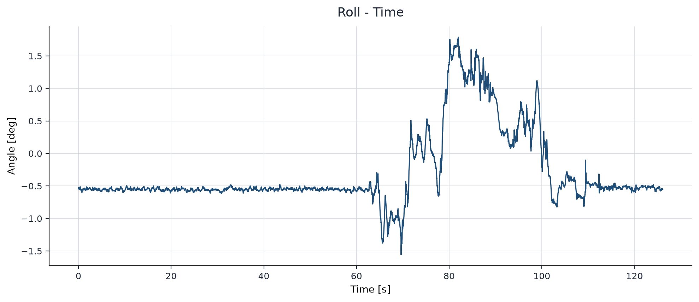
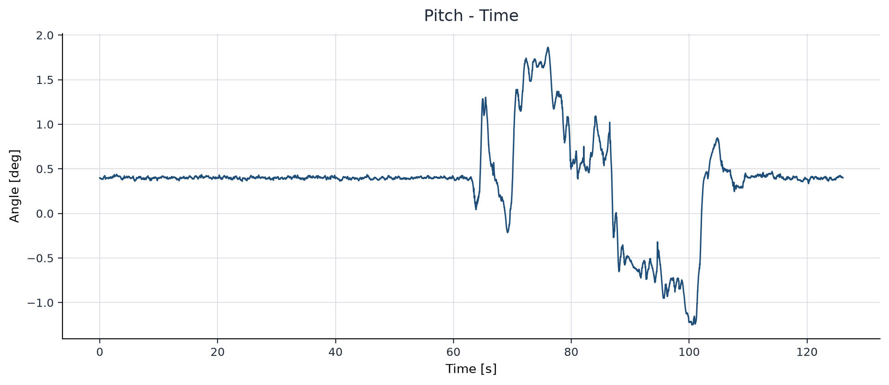
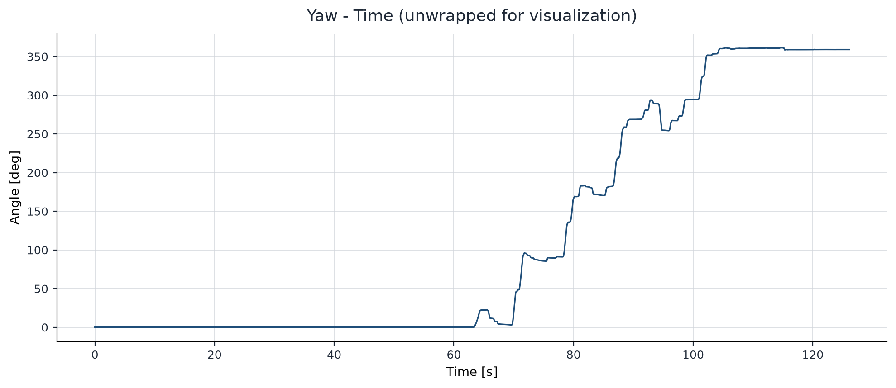

# 基于 IMU + FAST-LIO 的 ESKF 姿态解算

## 1. 项目目标

本项目使用 IMU 角速度进行姿态递推，并使用 FAST-LIO 姿态作为观测，逐步实现一个仅包含姿态与陀螺仪零偏的 6D Error-State Kalman Filter（误差状态卡尔曼滤波器，ESKF）。当前阶段强调数据语义、坐标约定和时间边界可审计，不扩展位置、速度或加速度计零偏状态。

## 2. 当前实现进度

已经完成：

- 原始 IMU 与 FAST-LIO CSV 校验和预处理；
- 加速度从 `g` 转换为 `m/s^2`；
- 初始静止区间统计；
- 单调、一对一的时间戳匹配；
- `xyzw` 四元数与旋转工具；
- processed `.npz` 的强校验加载器；
- FAST-LIO 四元数方向的源码与真实数据验证；
- 6D ESKF Initialization（初始化）：`q0`、`bg0`、`P0`、`Qc`；
- 6D ESKF Prediction：名义状态、`Fc/Gc/Phi/Qd` 与 `P` 预测；
- 6D 姿态 Observation Update、Injection 与 Reset；
- 完整 6D Runner、逐帧 RPY 结果、debug 日志与整段 summary；
- 正式 RPY 提交数据、Roll/Pitch/Yaw 曲线和 FAST-LIO Observation Reference 对比图。

尚未实现：任何 15D/位置/速度状态。当前没有 outlier gating、自动噪声调参或基于整段结果的参数调优。

## 3. 数据说明

正式运行代码通过 [processed_io.py](processed_io.py) 读取：

- `data/processed/imu_processed.npz`
- `data/processed/pose_processed.npz`
- `data/processed/init_stats.npz`
- `data/processed/match_table.npz`

IMU 角速度单位为 `rad/s`，加速度单位为 `m/s^2`。预处理数据保持原始测量含义，不预先扣除 `bg0`，也不执行重力补偿。`dt[0]` 为 `NaN`，因为第一个样本没有前驱；它不是人为补造的采样间隔。

默认无效行策略只丢弃无法解析为完整有限数值记录的行，并在诊断中记录原始 CSV 行号。若需要遇错即停，可在 `ProjectConfig` 中设置 `invalid_sample_policy="raise"`。时间戳重复或逆序、无效四元数和负协方差始终报错。

## 4. 数学与坐标约定

- 四元数存储顺序：`[qx, qy, qz, qw]`，即 `xyzw`。
- 姿态方向：`R_WB` 将 Body Frame 向量转换到 World Frame，`v_W = R_WB @ v_B`。
- 误差约定：右乘误差，`R_true = R_hat Exp(delta_theta^)`。
- 世界系重力：`g_W = [0, 0, -9.81] m/s^2`。
- 匹配误差：`pose_timestamp[j] - imu_timestamp[k]`。

当前 Nominal State（名义状态）为 `q_hat` 与 `b_g_hat`。Error State（误差状态）为：

```text
delta_x = [delta_theta, delta_b_g]
```

维度为 6。工程中不长期保存 `delta_x = zeros(6)`；后续 injection/reset 后将误差均值按零处理。

## 5. 第一阶段：数据预处理与时间对齐

预处理入口：

```powershell
python scripts/run_preprocess.py
```

该命令生成四个 processed `.npz`，以及 JSON 和文本诊断。时间匹配采用由数据采样周期确定的容差，保持 pose 不重复使用，并用 `-1` 标记没有有效 pose 的 IMU 样本。

## 6. FAST-LIO 姿态方向验证

本项目正式把 FAST-LIO CSV 四元数解释为 `q_WB`，但区分以下两类证据：

1. 标准 FAST-LIO 源码支持 `R_WB`：[`pointBodyToWorld`](https://github.com/hku-mars/FAST_LIO/blob/main/src/laserMapping.cpp#L165-L169) 使用 `state_point.rot` 将 IMU/body 点变换到全局；过程模型通过 [`s.rot * (in.acc - s.ba)`](https://github.com/hku-mars/FAST_LIO/blob/main/include/use-ikfom.hpp#L42-L53) 得到惯性系加速度；源码把 [`state_point.rot` 直接复制到 `geoQuat`](https://github.com/hku-mars/FAST_LIO/blob/main/src/laserMapping.cpp#L887-L897)，并发布 `camera_init -> body` 的 [odometry/TF](https://github.com/hku-mars/FAST_LIO/blob/main/src/laserMapping.cpp#L545-L574)。
2. 当前仓库没有生成所给 CSV 的导出代码，因此仅凭标准源码无法证明导出程序没有额外求逆或坐标变换。

真实静止数据在排除 20 个非正姿态协方差帧后，共使用 347 组匹配：

| 四元数假设 | 平均角误差 | 中位角误差 | 最大角误差 | 平均向量残差 |
| --- | ---: | ---: | ---: | ---: |
| `q = R_WB` | 0.736329 deg | 0.656430 deg | 1.699284 deg | 0.146254 m/s^2 |
| `q = R_BW` | 1.335364 deg | 1.293349 deg | 2.516289 deg | 0.240803 m/s^2 |

`R_WB` 在 86.17% 的样本上角误差更小；代表性平均姿态的误差分别为 0.400813 deg 与 1.231878 deg。在本项目设定的启发式判据下，真实数据支持 `R_WB`；结合标准 FAST-LIO 的源码和 frame 语义，本项目采用 `R_WB` 约定。重力只能约束 roll/pitch 方向，不能独立验证 yaw 语义。

复验命令：

```powershell
python scripts/check_pose_convention.py
```

## 7. Observation Covariance 使用说明

前 20 个 pose 帧的协方差对角线全零，时间范围为 `1786181234.225484610` 至 `1786181234.319545984`；静止初始化区间结束时间为 `1786181236.055275679`，因此当前数据从初始化点向后不会使用这些观测。

当前策略是：任一姿态方差 `<= 0` 时拒绝初始化或跳过后续观测。零方差会把观测解释为完全确定，可能造成奇异或过强更新；在没有数据依据时添加 covariance floor 会引入隐藏调参，因此当前不设置 `R_min`。

题面给出的 `cov_33/cov_44/cov_55` 是 roll/pitch/yaw 方差，而右乘 ESKF 使用局部旋转向量 `delta_theta`。两者严格来说不是同一坐标表达，映射依赖当前姿态、欧拉角顺序、误差乘法侧和坐标系。当前作业采用小误差工程近似：

```text
P_theta ≈ diag(cov_33, cov_44, cov_55)
```

当前不额外引入题目未要求的 Euler-to-tangent covariance Jacobian。

## 8. FAST-LIO 与 IMU 相关性假设

[FAST-LIO 是紧耦合 LiDAR-inertial estimator](https://github.com/hku-mars/FAST_LIO#fast-lio)，其姿态输出与本项目预测所使用的同一 IMU 数据并非严格统计独立。忽略交叉相关性可能重复利用信息、低估不确定性，并使名义 Kalman filter 不一致。

题目没有要求相关噪声或交叉协方差建模，因此本项目采用“过程噪声与观测噪声独立”的课程简化假设。这是明确的工程近似，不是严格独立性的声明。

## 9. 第二阶段：6D ESKF Initialization

[initialization.py](initialization.py) 只负责建立 `q0`、`bg0`、`P0` 和连续时间 Process Noise（过程噪声）`Qc`，不包含 Prediction 或 Update。

### 9.1 初始化时刻

静止区间为 `[static_start_idx, static_end_idx)`。当前数据为 `[0, 396)`，因此：

```text
static_end_idx = 396
k0 = static_end_idx - 1 = 395
t0 = imu.timestamp[k0]
j0 = alignment.pose_index_for_imu[k0]
```

`j0` 必须有效；若为 `-1`，直接报错，不前后搜索、不插值，也不改变 `k0`。`q0`、`bg0` 和 `P0` 都表示 `t0` 时刻的初始化状态。Prediction 的第一步为 `395 -> 396`，使用 `gyro[395]` 和 `imu.dt[396]`。

### 9.2 名义状态初值

```text
q0 = normalize_quaternion(pose.quaternion_xyzw[j0])
bg0 = init_stats.gyro_mean
```

`q0` 保持 `q_WB` 方向，不求逆。`bg0` 是 Gyro Bias（陀螺仪零偏）初值，不会写回或修改 processed IMU 数据。

### 9.3 初始协方差 P0

```text
N_static = static_end_idx - static_start_idx
P_theta0 = diag(pose.cov_diag[j0, 3:6])
P_bg0 = diag(init_stats.gyro_std**2 / N_static)
P0 = block_diag(P_theta0, P_bg0)
```

姿态方差必须有限且严格大于零。姿态与 bias 的交叉块保持为零，不人为加入 cross-correlation，也不增加 uncertainty floor。

### 9.4 连续时间过程噪声 Qc

Gyro Noise Density（陀螺仪噪声密度）由当前静止数据估计：

```text
gyro_noise_density = init_stats.gyro_std * sqrt(init_stats.median_dt)
Qg_diag = gyro_noise_density**2
```

这里使用真实 `median_dt`，不写死 200 Hz 或 `dt=0.005`。

约 2 秒的静止数据不足以可靠估计 Gyro Bias Random Walk（陀螺仪零偏随机游走）。配置项 `gyro_bias_random_walk_density = 1e-4` 是第一版工程初值，不是题面参数或传感器标定结果。后续需要结合 bias trajectory、innovation 和最终姿态结果检查并调参。

```text
Qbg_diag = [density**2, density**2, density**2]
Qc = diag(Qg_x, Qg_y, Qg_z, Qbg_x, Qbg_y, Qbg_z)
```

Initialization 模块只构造连续时间 `Qc`；离散化和协方差预测由 `eskf6d.py` 负责。

## 10. 第二阶段：6D ESKF Prediction

[eskf6d.py](eskf6d.py) 只维护数学滤波状态 `q_WB`、`b_g`、`P` 和固定的 `Qc`，不维护 IMU index 或 timestamp。每次 `predict()` 的调用方使用 Zero-Order Hold（零阶保持）的左端点约定：

```text
state[k] + gyro[k] + dt[k+1] -> state[k+1]
```

不使用 `gyro[k+1]`、相邻均值或 midpoint integration。名义状态预测为：

```text
omega_hat = gyro[k] - bg
delta_theta = omega_hat * dt[k+1]
q[k+1] = normalize(q[k] ⊗ Exp(delta_theta))
bg[k+1] = bg[k]
```

这里 `q_new = q_old ⊗ Exp(omega_B dt)` 的右乘来自两项物理定义：`q` 表示 `R_WB`，而陀螺仪角速度 `omega_B` 表达在 Body Frame。right-multiplicative error 则是 `R_true = R_hat Exp(delta_theta^)` 的误差状态 convention。两者在当前模型中相容，但名义姿态右乘不是由误差 convention 决定的。

IMU index、真实 timestamp 和 `gyro[k] + dt[k+1]` 的调度由诊断脚本及 [runner6d.py](runner6d.py) 负责。pose matching 必须直接使用 `imu.timestamp[k]` 和 `alignment.pose_index_for_imu[k]`；不得使用滤波器内部累计时间，也不得从 `dt` 反推权威时间戳。

连续误差模型和噪声映射为：

```text
Fc = [-hat(omega_hat)  -I]
     [       0          0]

Gc = [-I  0]
     [ 0  I]
```

第一版只采用一阶离散近似：

```text
Phi ≈ I + Fc * dt
Qd ≈ Gc @ Qc @ Gc.T * dt
P_new = Phi @ P_old @ Phi.T + Qd
```

`Qd ≈ Gc Qc Gc.T dt` 是当前第一版的一阶离散近似，忽略高阶 `dt^2/dt^3` 噪声耦合。当前作业接受这一简化；完整 6D 闭环完成后，需要结合 `P`、innovation、`K` 和最终姿态结果重新检查离散化是否足够。`Qd` 使用每一步真实 `dt[k+1]`，不使用静止段 `median_dt` 或写死的 200 Hz。

预测后对 `P` 做 `0.5 * (P + P.T)` 数值对称化，并检查有限性、对称性和对角线非负性；不把明显负值偷偷 clamp 为零。

当前 Prediction 不读取 CSV、不修复时间戳、不插值 IMU。姿态观测更新由同一数学模块的独立 `update_attitude()` 完成，调度和 pose selection 仍在模块外部。

## 11. 第二阶段：Observation Update、Injection 与 Reset

`update_attitude(q_obs_xyzw, R_attitude)` 只接收 FAST-LIO 姿态和 `3x3` 姿态协方差，不接收 timestamp、IMU index 或 pose index。未来 scheduler 决定是否调用：若原始 pose 的任一姿态方差 `<= 0`，直接跳过该观测，不构造零 `R`；若非法 `R` 被传入数学模块，函数明确报错，不添加 floor 或 epsilon。

四元数存在 `q == -q` 的双覆盖。计算 residual 前先根据 `dot(q_pred, q_obs)` 对齐符号，然后按照右乘误差 convention 构造：

```text
q_rel = inverse(q_pred) ⊗ q_obs_aligned
r_theta = Log(q_rel)
H = [I3  0]
```

`R_attitude = diag(cov_33, cov_44, cov_55)` 继续作为局部右乘 rotation-vector residual covariance 的小误差近似；当前不增加 Euler-to-tangent Jacobian。

Innovation 与增益使用线性求解而非显式矩阵求逆：

```text
S = H P H.T + R
K = P H.T S^-1
delta_x = K r_theta
```

`delta_x` 只是一轮更新的临时量。Measurement covariance 先采用 Joseph Form，随后分别执行名义状态 Injection 和 error-coordinate Reset：

```text
A = I - K H
P_upd = A P A.T + K R K.T

q <- q ⊗ Exp(delta_theta)
bg <- bg + delta_bg

G_reset[0:3, 0:3] = I - 0.5 * hat(delta_theta)
P <- G_reset P_upd G_reset.T
```

Joseph Update 与 Reset 是两个不同步骤。最终 `0.5 * (P + P.T)` 只清除 floating-point arithmetic 产生的微小非对称误差，不是新的滤波公式；若平均前的不对称超过 `covariance_symmetry_tolerance`，直接报错，不能靠平均掩盖明显错误。

`ESKF6D` 持有创建时传入的 `NumericalSafetyConfig`，后续 covariance negative/symmetry tolerance 均来自该实例配置。Update 完成全部 residual、Joseph、Injection、Reset 和数值检查后才一次性提交 `q/bg/P`，中途失败不会留下半更新状态。NIS 仅用于开发期诊断，不用于 gating 或自动调参。

## 12. 完整 6D Runner 与输出

[runner6d.py](runner6d.py) 只负责调度、整段数值安全检查和日志收集，不重新实现 ESKF 数学。`ESKF6D` 仍然只持有 `q`、`bg`、`P` 和 `Qc`，不持有 IMU index、timestamp 或 pose index。完整运行固定采用：

```text
Initialization posterior at k0
    -> Prediction: gyro[k] + dt[k+1]
    -> optional FAST-LIO Update at k+1
    -> log posterior state at imu.timestamp[k+1]
```

当前 `k0 = 395`。初始化已经使用 `alignment.pose_index_for_imu[395]` 对应的 FAST-LIO 姿态建立 `q0/P0`，因此 Runner 只记录一次初始化 posterior，不会在 `k0` 重复调用 Update。第一条正式传播仍为 `395 -> 396`，使用 `gyro[395]` 和 `dt[396]`。

每个后续 IMU index 的时间只读取 `imu.timestamp[k]`，pose 只读取预处理产生的 `alignment.pose_index_for_imu[k]`。Runner 不累加 `dt` 生成时间、不重新 nearest-match、不插值、不搜索相邻 pose，也不重复使用 pose。没有匹配时继续 Prediction；匹配姿态方差任一项 `<= 0` 时按 scheduler policy 跳过 Update 并记录原因。

正式入口：

```powershell
python scripts/run_eskf6d.py
```

输出文件：

- `results/eskf6d_result.csv`：正式逐帧 posterior 结果，包含真实 timestamp、IMU index、`xyzw` 四元数、ZYX RPY（rad）、gyro bias 和观测/update 标志；第一行是 `k0` 初始化状态。
- `results/eskf6d_debug.csv`：开发期诊断，包含调度来源、`omega_hat`、`P` 数值安全量，以及有效 Update 的 residual、`R`、NIS、correction 和 Kalman gain 主要对角项；没有 Update 的字段保留为 `NaN`。
- `results/eskf6d_summary.json`：整段范围、观测计数、四元数/协方差安全统计、bias、residual、NIS、RPY 与大 `dt` 统计。

Runner 对每个最终 `P` 执行对称性和 PSD 检查；仅允许 `covariance_negative_tolerance` 范围内的极小数值负特征值，不执行 eigenvalue clipping。NIS 只记录，不用于 gating、reject、修改 `R/Q` 或自动 tuning。大 `dt` 使用真实间隔继续传播，统计阈值沿用预处理的 `timestamp_large_step_ratio * median_dt` 定义。

完整运行成功只说明当前 6D ESKF 的调度、闭环计算和诊断输出能够从 `k0` 稳定执行到数据末尾。它不证明 `Q/R/P0` 或其他参数合理；参数合理性必须留到下一阶段结合 `P`、innovation、NIS、Kalman gain、bias 与最终姿态结果进行人工分析。

## 13. Phase 2.4B-1：NIS / Innovation 诊断分析

[scripts/analyze_eskf6d.py](scripts/analyze_eskf6d.py) 只读取已保存的 result、debug 和 summary，不重新运行滤波。它定位 high-NIS 的时间、连续片段、轴向 residual 和 covariance 相关量，并输出 `results/analysis/` 下的 JSON/CSV 证据。

`chi-square(df=3)` 阈值只是在标准独立 Gaussian Kalman 假设下的诊断参考。FAST-LIO 本身使用 IMU，Prediction 与 Observation 并不严格独立。本阶段不做 NIS gating、observation rejection 或 tuning，不修改 ESKF 数学、`Q/R/P0` 或正式 result 输出，也不根据相关性自动生成参数结论。

## 14. Phase 2.5：正式 RPY 曲线与实验结果

[plot_result.py](plot_result.py) 只读取已冻结的正式结果和已有诊断摘要，不重新运行或修改滤波器。入口为：

```powershell
python scripts/plot_eskf6d_results.py
```

该命令生成 `results/rpy_result.csv`、五张 PNG 图和 `results/experiment_result_summary.json`。RPY CSV 保留与 `eskf6d_result.csv` 逐元素一致的 raw radians，同时提供 degrees；时间轴严格使用 `timestamp - timestamp[0]`，不通过累加 `dt` 重建。Yaw 仅在绘图和提交用衍生列中执行 unwrap，Roll/Pitch 不 unwrap，所有曲线均未平滑、滤波、删帧或重采样。Yaw is unwrapped for visualization only.

本次完整实验持续 `126.094735 s`，包含 `25219` 个 posterior 输出帧、`25218` 次 Prediction 和 `25212` 次成功 Update。最大四元数范数误差为 `2.220446049250313e-16`，最大 `P` 对称误差为 `0.0`，最小 `P` 特征值为 `2.1881125014605517e-09`，正式结果全部为有限数值。







总览及观测对比另见 `results/figures/rpy_overview.png` 和 `results/figures/rpy_fastlio_comparison.png`。FAST-LIO 姿态只按已有 `pose_index_for_imu` 映射，未重新匹配或插值。由于 FAST-LIO 本身使用 IMU，它在此只是 **Observation Reference**，不是独立 Ground Truth；该图仅展示趋势和观测一致性，不用于宣称真实姿态 RMSE。

完整 6D ESKF 能够稳定运行，大多数时段 Prediction 与 FAST-LIO Observation residual 较小；较强动态旋转时，局部 y/z 方向 residual 更明显。正式 Prediction 仍采用 left-endpoint ZOH：`delta_theta = omega[k] * dt`。离线诊断表明，相邻 gyro 平均值的梯形近似能降低多数典型动态 interval 的单步姿态增量误差，因此 left-endpoint ZOH 是已确认的部分动态误差来源，但 high-NIS 的 p95/max 尾部仍未消除，它不是唯一根因。诊断也未发现稳定、一致且能显著降低 RMSE 的固定时间偏移，因此固定 FAST-LIO latency 假设被削弱。本作业正式版本不升级传播方法、不调参；更高阶 propagation 仅作为后续工程优化方向。

## 15. 运行方式

使用安装了 NumPy 和 Matplotlib 的 Python 环境：

```powershell
python scripts/check_pose_convention.py
python scripts/check_initialization.py
python scripts/check_prediction.py
python scripts/check_update.py
python scripts/run_eskf6d.py
python scripts/analyze_eskf6d.py
python scripts/plot_eskf6d_results.py
python -m unittest discover -s tests -v
```

`check_initialization.py` 只输出初始化量；`check_prediction.py` 只检查第一个真实 Prediction 和后续 20 步 Prediction-only 短序列；`check_update.py` 只检查第一组真实 Prediction + Update。它们都不是正式滤波入口。`run_eskf6d.py` 是完整运行和正式结果输出入口；`plot_eskf6d_results.py` 只整理已保存结果，不会重跑滤波或调参。

## 16. 开发期测试与最终提交整理

`tests/`、`scripts/check_pose_convention.py`、`scripts/check_initialization.py`、`scripts/check_prediction.py` 和 `scripts/check_update.py` 都属于开发期验证资产，与正式算法模块隔离。当前保留这些文件用于人工审核和回归检查；项目完成后将单独执行 submission cleanup，只保留题目要求和程序正常运行所需的正式代码。
